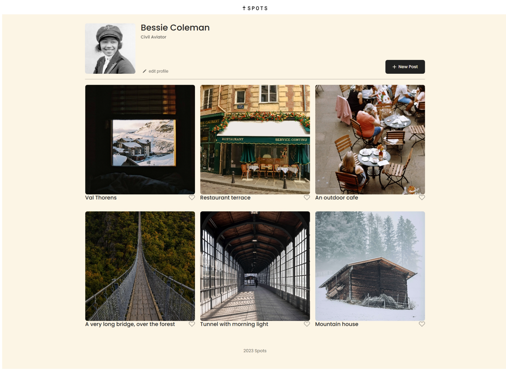

The project's name: Sprint 3 Spots

#Intro:

A description of the technologies and techniques used: Therefore I am using the Vs code to do my webpage project for sprint 3. However the techniques I used is to learned how to read the measurments when it come to creating a webpage and also when to know that you are using the right class for it.
Therefore I have to used figma webpage brief, where I get my layouts on working with differents screens to make it look perfect and standout. However figma also is where that you can get your resources for your HTML CSS vscode for projects to help you to understand it well. However when it comes to creating and puting things in place you want to make things easy for you to understand step by step. Such as thinking and reading the brief while doing the project and double check your work in both classes HTML and CSS it is very important do these things so you can catch your erros before submmiting your project.

#Picture/link Git Hub:

Pictures, GIFs, or screenshots that detail the project features (highly recommended)

The link to your deployed project on GitHub Pages: https://reggiero31.github.io/se_project_spots/

#project spots 3 video#

https://www.loom.com/share/73b04ce2fa7e40b98a85a386149b77c8

https://www.loom.com/share/f82b7aeee92345acbaba6e046983024b

The project name: spots final project

 reggie spots final project video:
 https://www.loom.com/share/e0563e3483994d31bb182d8cd76a3639

Therefore the description of my Spots final project is amazing and in my viedo I went over different steps that I use when it comes to building a sucessful project. However this project has help me to build my confidence to stay focus and driven and also it has challenge me to always ask questions if I need any assistance with anything. Therefore I had been working on this project for a while I just wanted to make sure everything is functional before I submitted it in my github folder.